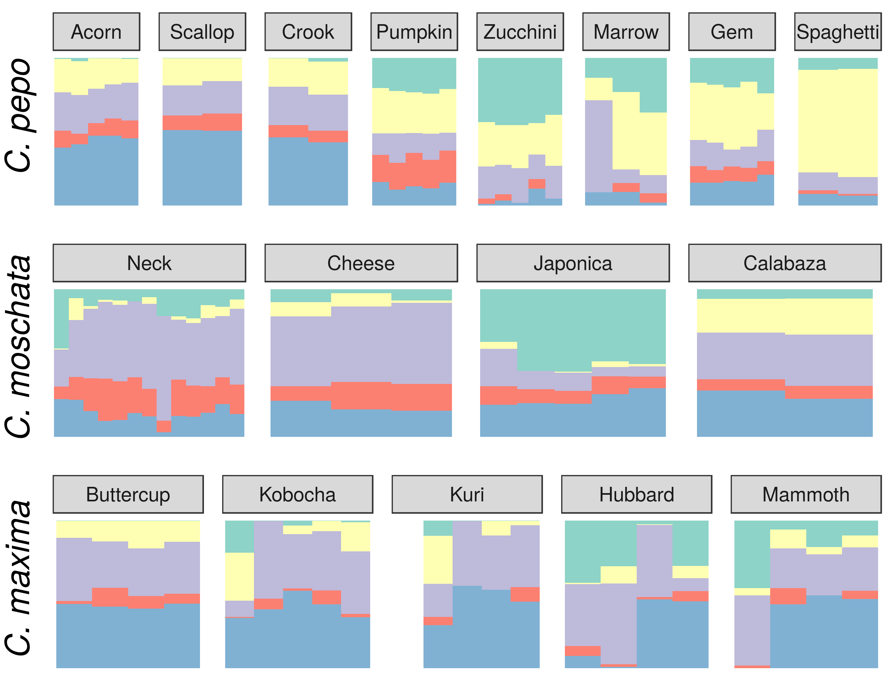
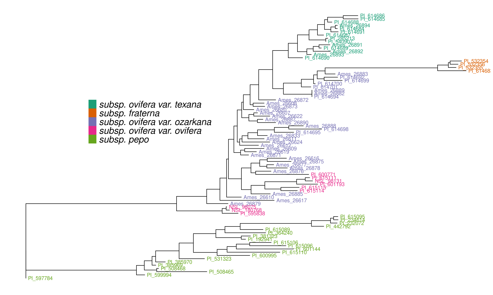
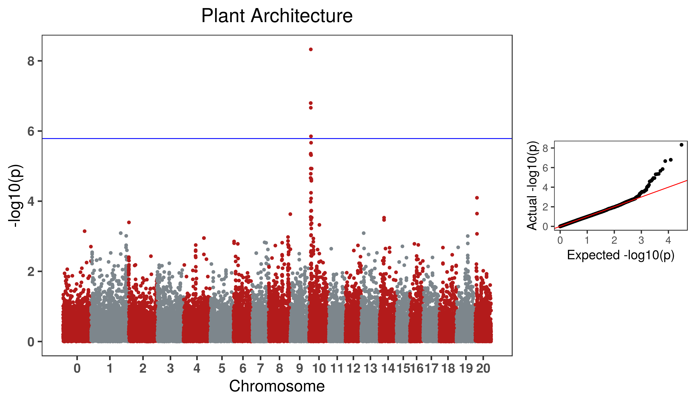

## Results

### Genotyping

Each *Cucurbita ssp.* collection was genotyped using the Cornell Genotype by Sequencing (GBS) protocol. 
This resulted in 534 accessions for *C. maxima*, 314 for *C. moschata*, and 829 for *C. pepo*. 
Figure {@fig:world} shows the regional distribution of accessions broken down by species. 
*C. maxima* and *C. moschata* constitute the majority of accessions collected from Central and South America, whereas *C. pepo* accessions are more prevalent in North America and Europe. 
*C. pepo* had the highest number of raw SNPs (108,279) followed by *C. moschata* (85,345) and *C. maxima* (56,598). 
After filtering, *C. pepo* and *C. moschata* had a similar number of SNPs, around 40,000, whereas *C. maxima* had an order of magnitude fewer filtered SNPs (4787).
This discrepancy may be an artifact of using Pst1, a rarer base-cutter previously optimized for use in *C. maxima* [@doi:10.1186/s12864-015-2312-8 ], rather than ApeK1 which was used for *C.pepo* and *C. moschata*. 
The number and distribution of SNPs across each chromosomes is shown in Table {@tbl:snp_info}. 

{#fig:world} 

|Chrom. | *C. pepo* |  |*C. moschata* | | *C. maxima*| |
|----------|----------|----------|----------|----------|----------|----------|
| |Raw | Filtered| Raw | Filtered| Raw | Filtered |
|0 |16901|5656|3748|1236|1501|419|
|1 |9245|4155|4575|2627|4185|300|
|2 |6160|2921|4092|2535|2101|169|
|3 |5908|2668|3815|2393|2201|157|
|4 |5540|2652|7868|4458|5703|382|
|5 |4813|2254|3226|1804|3115|154|
|6 |4555|2100|3663|2182|3035|345|
|7 |3677|1761|3300|1784|2705|148|
|8 |4551|2189|2692|1577|2391|191|
|9 |4521|1995|3427|1902|2750|229|
|10 |4366|2052|4219|2225|2297|120|
|11 |3839|1727|5212|2962|3713|309|
|12 |3777|1614|5329|2286|2026|162|
|13 |4002|1879|3888|2013|2131|257|
|14 |4275|1973|5568|3198|4317|297|
|15 |3086|1427|3911|2358|2662|172|
|16 |4274|1589|3407|1987|2058|302|
|17 |3519|1657|3557|1888|2195|251|
|18 |3568|1723|3775|2105|1826|133|
|19 |4015|1860|3278|1716|1793|169|
|20 |3687|1692|3795|1623|1893|133|
|Total|108279|47544|85345|46859|56598|4799|

Table: Distribution and number of raw and filetered SNPs per chromosome for each species {#tbl:snp_info}

### Population Structure and Genetic Diversity

{#fig:struc}

|Group|Species|||
|----|----|----|----|
||*C. pepo*|*C. moschata*|*C. maxima*|
|1|Europe/Asia, mostly for Turkey|South American/Latin American|Mixed origin; kobocha/turban types|
|2|Europe, mostly from Macedonia|South American/Latin American|European, mostly from Macedonia|
|3|North America, wild and landrace *ovifera*|African|Asia |Pacific/Middle East|
|4|Mixed origin|India|South American|
|5|South America, mostly from Mexico|Mixed origin; elongated fruit type|African|

Table: Commonalities among accessions in each group, most groupings are dictated by geography. {#tbl:struc_info}

{#fig:cult}

Filtered SNPs were used for population structure analysis. 
Available geographical, phenotypic, and other metadata were retrieved from GRIN and were used to help interpret structure results. 
Results from model-based admixture analysis are shown in Figure {@fig:struc} panel A. 
These data support five ancestral groups (K=5) in each of the species. 
Population structure was driven mostly by geography, except in *C. pepo* where the presence of different subspecies was responsible for some of the structure.
Commonalities among structure groups are described in Table {@tbl:struc_info}. 
The first two principal components (PCs) derived from principal components analysis (PCA) of the marker data are shown in Figure {@fig:struc} panel B. 
As with the model-based analysis, PCA  showed geography as a main driver of population structure with accessions being derived from Africa, the Arab States, Asia, Europe, North America, and South/Latin America. 
PC1 in *C. pepo* separates *C. pepo* subsp.*ovifera*, which have a North American Origin, from subsp. *pepo*. 

{#fig:phylo}

Ancestry proportions from admixture analysis were projected onto cultivars/market types identified in the accessions, which were excluded from the initial analysis used to infer ancestral groups. 
Cultivars were grouped according to known market class within species to help identify patterns in ancestry among and between market classes. 
Key market types identified in accessions from *C. pepo* including Acorn, Scallop, Crook, Pumpkin (jacko' lantern), Zuchinni, Marrow, Gem, and Spaghetti; Neck, Cheese, Japonica, and Calabaza in *C. moschata*; and Buttercup, Kobocha, Kuri, Hubbard, and Mammoth (show squash) in *C. maxima*. 
These groupings are shown in Figure {@fig:cult}. 
In general, members of each market class exhibit similar ancestry proportions. 
In *C. pepo* market classes from the two different subspecies had distinct ancestry patterns. 
For example, Acorn, Scallop and Crook market classes are all from subsp. *ovifera* and all of these classes had similar ancestry proportions with roughly 50% of ancestry from the wild *ovifera*. 
In contrast, market classes within *pepo* had a small percentage of ancestry from wild *ovifera* and more ancestry in common with European and Asian accessions.
With *C. moschata*, Neck and Cheese type market classes showed very similar ancestry patterns, whereas the Japonica and Calabaza types were more distinct. 
Relative to the *C. pepo* and *C. moschata*, the *C. maxima* cultivars were less distinct from one another.

Unlike *C. moschata* and *C. maxima*, several different subspecies were present in the *C. pepo* collection, including some wild specimens.
A group of 82 accessions with 11,065 high-quality SNPs was used for constructing an unrooted phylogenetic tree. 
The tree is shown in Figure {@fig:phylo} and recapitulates the relationships among *pepo* subspecies shown in previous work [@doi:10.1016/j.ympev.2017.03.002].

### Analysis of Phenotypic Data

All available historical data  from GRIN were compiled. 
Only traits with $\geq$ 100 entries were considered for further analysis. 
Filtering resulted in 21 traits for *C. pepo*, 5 for *C. moscahta* and 16 for *C. maxima*. 
Traits spanned fruit and agronomic-related characteristics, as well as pest resistances. 
The number of records for a given trait ranged from 108 to 822, with an average of  $\sim$ 270. 
Fruit traits included fruit width, length, surface color and texture, and flesh color and thickness. 
Agronomic data included plant vigor and vining habit, and several phenotypes related to maturity. 
Pest-related traits included susceptibility to cucumber beetle and squash bug in *C. pepo* and watermelon mosaic virus (WMV)  and powdery mildew (PM) in *C. maxima*. 

Around half of the traits were quantitative/ordinal and half were categorical and coded as binary traits, see Table {@tbl:params}. 
The majority of traits measured on a quantitative scale were normally distributed. 
Marker-based narrow-sense heritability ($h_{G}^2$) was calculated for each trait. 
Values for $h_{G}^2$ ranged from 0.12 to close to 1. 
Most traits had moderate to high heritabilities ($\geq$ 0.4). 
Regression of trait data on the $\mathbf{Q}$ matrix obtained from structure analysis was used to determine the amount of phenotypic variation explained by population structure. 
In *C. pepo*, traits related to fruit morphology tended to have high correlations with population structure ($R_{pop}^2$). 
Seed weight had the highest correlation with an $R_{pop}^2$ of 0.6. In *C. moschata*, maturity showed the highest correlation with population structure ($R_{pop}^2$ of 0.52). 
None of the 16 traits in \textit{C. maxima} had a high correlation with population structure. 
The only exception was plant growth habit.Traits related to pest resistance were measure in *C. maxima* and *C. pepo* and had among the lowest correlations with population structure.

 || Trait | Description | Pop Size | $h_{G}^2$ | $R_{pop}^2$ |
 |----|----|----|----|----|----|
 |*C. pepo*||||||
 ||Max Fruit Thickness | Maximum fruit thickness in centimeters|421 |0.72 | 0.27 |
 ||Min Fruit Thickness | Minimum fruit thickness in centimeters|174|0.58 | 0.14 | 
 ||Min Fruit Length| Minimum fruit length in centimeters|413|0.82 | 0.37 |
 ||Max Fruit Length| Maximum fruit length in centimeters|315|0.91 | 0.33 | 
 ||Max Fruit Width | Minimum fruit width in centimeters|303|1.00 | 0.49 |
 ||Min Fruit Width | Maximum fruit width in centimeters|413|1.00 | 0.49 | 
 ||Fruit Texture| Fruit texture coded as smooth or not smooth|130|0.55 | 0.23 | 
 ||Fruit Skin Pattern | Skin patterning coded as solid color or patterned|248| 0.58 | 0.27 | 
 ||Fruit Shape1 |Fruit shape coded as oblong or not oblong|331| 0.69 | 0.60 |
 ||Fruit Shape2|Fruit shape coded as globe or not globe|331|0.67 | 0.48 |
 ||Flesh Color|Flesh color coded as either yellow or orange|377|0.53 | 0.19 | 
 ||Fruit Color1 | Color of fruit coded as yellow or not yellow |181| 0.55 | 0.19 | 
 ||Fruit Color2 | Color of fruit coded as green or not green|181|0.68 | 0.55 | 
 ||Cucumber Beetle Damage | Severity of beetle damage on a 0-4  scale|248|0.32 | 0.08 |
 ||Adult Squash Bug | Number of adult squash bugs on plant|237|0.88 | 0.07  |
 ||Nymph Squash Bug |Number of squash bug nymphs on plant|166| 0.46 | 0.02  |
 ||Plant Type1 | Historical plant architecture data coded as vining or bush|404|0.64 | 0.37 | 
 ||Plant Type2 |Contemporary plant architecture data coded as vining or bush|293|1.00 | 0.36 | 
 ||Plant Vigor1 | Minimum plant vigor on 1-5 scale|414| 0.54 | 0.14 |
 ||Plant Vigor2 |Maximum plant vigor on 1-5 scale|414| 0.54 | 0.14  | 
 ||100 Seed Wt.|Weight of 100 seeds in grams|822| 0.90 | 0.60 | 
 |*C. moscahta*||||||
 ||Fruit Color|Fruit color coded as orange or not orange |140|0.43 | 0.13 |
 ||Fruit Surface Texture| Fruit surface texture encoded as smooth or not smooth|127|0.18 | 0.07 |
 ||Fruit Diameter | Fruit diameter in centimeters|122|0.62 | 0.18 |
 ||Fruit Length | Fruit length in centimeters|121|1.00 | 0.18  |
 ||Maturity|Fruit maturity on scale of early to late (1-8)|108|1.00| 0.52 |
 |*C. maxima*||||||
 ||Fruit Color1 |Fruit color encoded as gray or not gray |183| 0.53 | 0.17 |
 ||Fruit Color2 |Fruit color encoded as orange or not orange |183| 0.57 | 0.08 |
 ||Fruit Color3|Fruit color encoded as green or not green|183| 0.46 | 0.15 |
 ||Flesh Color |Flesh color on a scale of yellow to dark orange (1-5)|231| 0.44 | 0.09|
 ||Flesh Depth |Flesh thickness in centimeters|251| 0.29 | 0.01|
 ||Fruit Diameter |Fruit diameter in centimeters|248| 0.37 | 0.29 |
 ||Fruit Length |Fruit length in centimeters|248| 0.49 | 0.27 |
 ||Fruit Spot |Fruit spotting from slight to pronounced (1-9)|193| 0.40 | 0.01|
 ||Fruit Ribbing|Fruit ribbing from slight to pronounced (1-9)|243| 0.64 | 0.14 |
 ||Powdery Mildew Susceptibility|Susceptibility to PM from slight to severe (0-9)|211| 0.33 | 0.06|
 ||WMV Susceptibility|Susceptibility to WMV from slight to severe (0-9)|212| 0.19 | 0.05 |
 ||Fruit Set |Fruit set from poor to excellent (1-9)|251| 0.36 | 0.15|
 ||Uniformity |Fruit uniformity from poor to excellent (1-9)|244| 0.35 | 0.07 |
 ||Vigor |Plant vigor from poor to excellent (1-9)|251| 0.12 | 0.00 |
 ||Plant Type|Plant type as vining or not vining|251| 0.74 | 1.19 |
 ||Days to Pollen |Number of days from field transplanting to date of first pollination|236| 0.52 | 0.15|

Table: Summary of trait data used for association analysis. A brief description is given for each trait followed by the number of entries with records, the genomic heritability ($h_{G}^{2}$), and the R-square value from multiple linear regression of population structure on phenotype ($R_{pop}^{2}$). Trait names followed by a number (e.g. Fruit Color1) are traits derived from alternative coding of multi-class categorical traits. {#tbl:params}

### Genome-wide Association

{#fig:gwas}

Genome-wide association was conducted for all traits using standard mixed-model analysis. 
No significant signals were detected in *C. moschata*. 
A weak signal was detected in *C. maxima* for fruit set on chromosome 12 and fruit ribbing on chromosome 17. 
Three phenotypes were significantly associated with SNPs in *C. pepo*: bush/vine plant architecture on chromosome 10, fruit flesh color on chromosome 5, and fruit width on chromosome 3. 
The bush/vine phenotype exhibited the strongest signal, and the Manhatten plot and p-value quantile-quantile plot is shown in Figure {@fig:gwas}.

### Syntenty of *Bu* putative region in *C. pepo* and *C. maxima*

### Development of a Core Collection

A core set of accessions that covered over 99\% of total genetic diversity was identified in each of the panels. 
Roughly 10 to 20\% of the accessions were required to capture the genetic diversity in the panels (See Supplemental Figures Figure {@fig:core}). 
This amounted to 245 accessions in *C. pepo*, 154 in  *C. moschata*, and in 248 *C.maxima*. 
The core subset identified in *C. pepo* was augmented with accessions that represented key market classes or that had traits of interest to breeding programs.
Additionally, key accessions were selected from *C. maxima*, *C. moschata* and some wild species. 
Together these genotypes were purified through two additional rounds of selfing and seed will serve as the basis for a *Cucurbita ssp.* core to be used by breeding programs and researchers for further studies.
